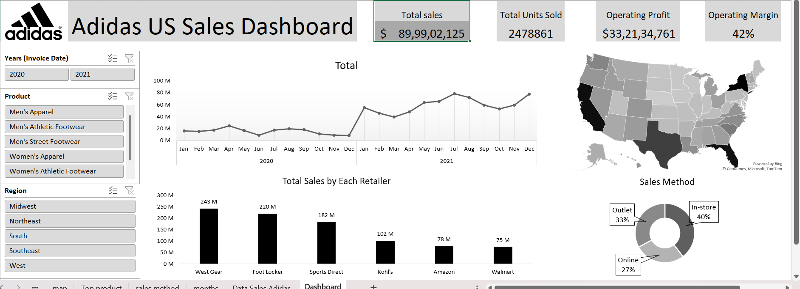

# Excel_Dashboard-2
# 👟 Adidas US Sales Dashboard

A professional Excel dashboard to analyze Adidas’s sales performance across U.S. regions, retailers, and product categories. Built with interactive slicers, KPI cards, and geo-based visuals to deliver a complete sales overview.

---

## 📸 Screenshot

---

## 🔍 Key Features

- 💵 Total Sales, Units Sold, Operating Profit & Margin in KPI cards  
- 🗺️ U.S. map showing state-wise sales distribution  
- 📈 Monthly sales trend analysis (2020–2021)  
- 🛒 Bar chart of top retailers by total sales  
- 🍩 Donut chart showing sales method share (In-store, Online, Outlet)  
- 🔘 Filters by Year, Product Category, and Region

---

## 🚀 Tools Used

- Microsoft Excel  
- Pivot Tables & Pivot Charts  
- Slicers
- KPI Cards (with custom formatting for ₹ / $ in Millions)  
- Excel Map & Donut Chart for visual storytelling

---

## 🧠 Use Case

Great for showcasing:
- Excel dashboard design skills  
- Data visualization and storytelling  
- Business analysis based on product and region insights  
- Portfolio for analytics and BI roles

---
